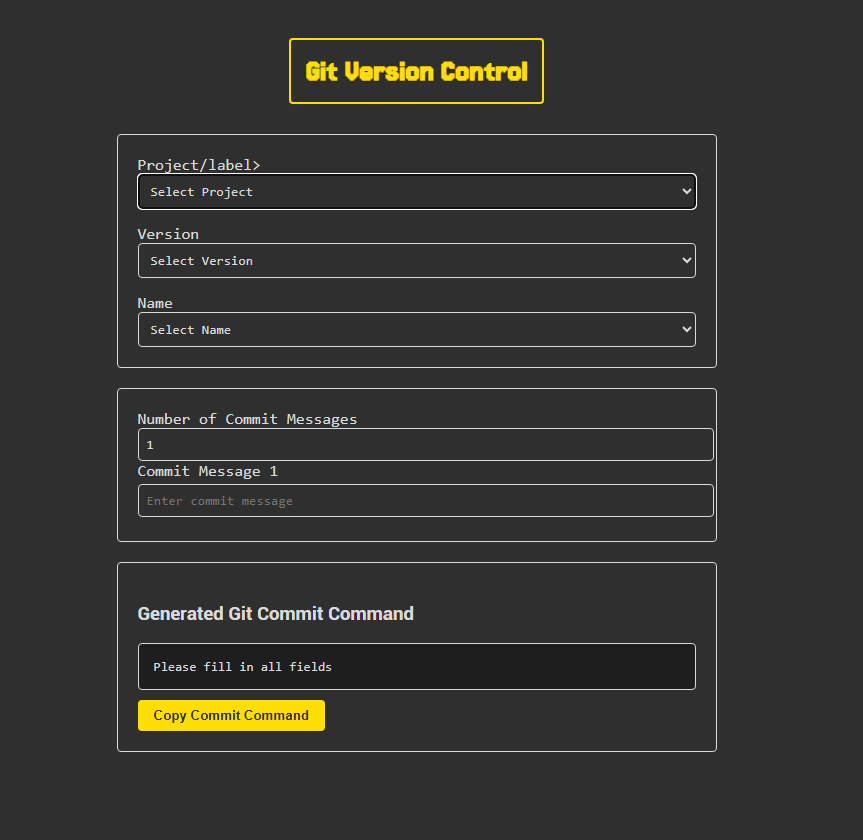

# App in Production

-- Git Version Control

## Goals of The git-version-controller

-- The main goal is to help you as a programmer with a simple Version Control Template:
Version: number(1.2.3) - Name(Name Templates)
-- commit message
-- commit message

-- Interface for -> Selecting -> (the) Version
-- Interface for -> Selecting -> (the) Name
-- Interface for -> Selecting -> (the) Messages (number) - After slecting a number you add the massages for each one

-- A full `git commit -m + formated message` gets generated and you can simply copy/paste it into your terminal

---

# Git Version Controller Interface

---
