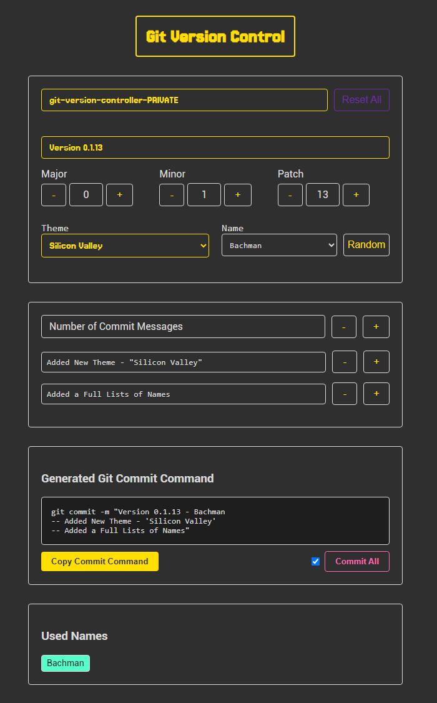

# App in Development

-- Git Version Control

## Goals of The git-version-controller

-- The main goal is to help you as a programmer with a simple Version Control Template:
Version: number(1.2.3) - Name(Name Templates)
-- commit message
-- commit message

-- Interface for -> Selecting -> (the) Version
-- Interface for -> Selecting -> (the) Name
-- Interface for -> Selecting -> (the) Messages (number) - After slecting a number you add the massages for each one

-- A full `git commit -m + formated message` gets generated and you can simply copy/paste it into your terminal

---

# Git Version Controller Interface



---

# Git Version Controller

A modern web application that helps developers create well-formatted git commit messages with version tracking and themed name attribution.

## Features

### Version Control

- Semantic versioning (Major.Minor.Patch)
- Visual version control with increment/decrement buttons
- Persistent version tracking
- Active version display with custom styling

### Project Management

- Project name input with persistence
- Recent projects display
- Project name locking after confirmation
- Reset functionality for all fields

### Commit Message System

- Dynamic multi-line commit messages (1-5 lines)
- Custom message formatting
- Easy message addition/removal
- Proper escaping of special characters

### Name Attribution

- Themed name selection (currently featuring Silicon Valley theme)
- Random name selection
- Used names tracking
- Name history display
- Automatic filtering of used names

### Git Integration

- One-click copy of formatted git commands
- Optional git add/push command inclusion
- Proper command formatting for multi-line messages
- Clipboard integration

## Usage

1. **Project Setup**

   - Enter your project name and press Enter to lock it
   - Select your version number using the controls
   - Choose a theme and name from the dropdowns

2. **Commit Messages**

   - Use the +/- buttons to add/remove commit message lines
   - Enter your commit messages in the provided fields
   - Messages are automatically formatted

3. **Command Generation**
   - View your formatted git command in the output section
   - Use the "Copy Commit Command" button to copy
   - Check the box to include git add/push commands
   - Use "Commit All" for a complete git workflow

## Styling

- Modern dark theme interface
- Responsive design
- Custom fonts (Jersey 15, Pixel7)
- Visual feedback for active states
- Consistent color scheme

## Technical Details

- Built with Flask
- Uses localStorage for persistence
- Modern JavaScript (ES6+)
- Responsive CSS with CSS variables
- No external dependencies

---

## Installation

1. Clone the repository:
   ```bash
   git clone https://github.com/pglbiscuite/git-version-control.git
   cd git-version-control
   ```
2. Install Flask:
   ```bash
   pip install flask
   ```
3. Run the application:
   ```bash
   python app.py
   ```
4. Open your browser to `http://localhost:5000`

### Linux

1. Clone the repository:
   ```bash
   git clone https://github.com/pglbiscuite/git-version-control.git
   cd git-version-control
   ```
2. Install Flask:
   ```bash
   pip install flask
   ```
   Or if you prefer using a virtual environment:
   ```bash
   python3 -m venv venv
   source venv/bin/activate
   pip install flask
   ```
3. Run the application:
   ```bash
   flask --app app run
   ```
   Or alternatively:
   ```bash
   python3 app.py
   ```
4. Open your browser to `http://localhost:5000`

---

## License

This project is licensed under the MIT License - see the LICENSE file for details.
